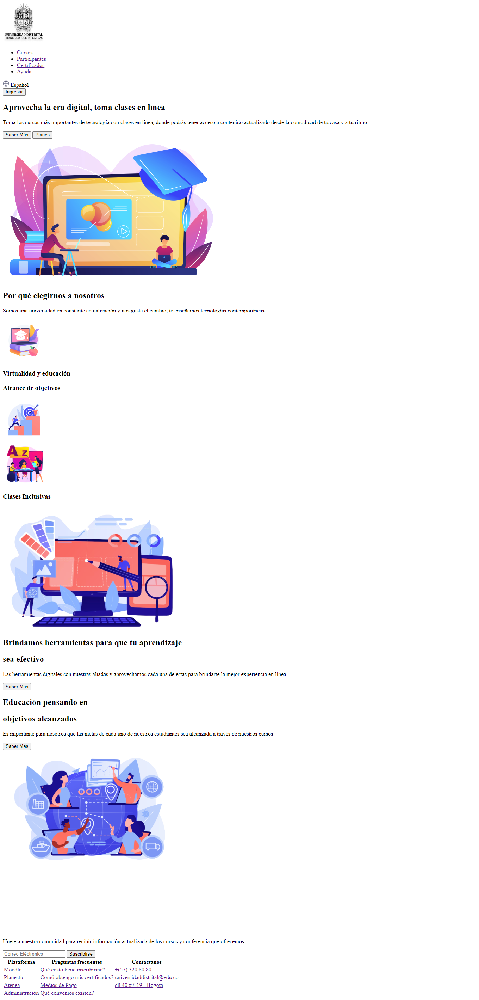

<h1>Taller 9: Carmen Camacho</h1>

<h2>Punto 1: Link de Figma</h2>

Curso Full Stack - Grupo 1

Profesor: Cristian Felipe Patiño

<a href="https://www.figma.com/file/kz9njeScyFchCOZSkeHFJI/Carmen-Camacho?type=design&node-id=0-1&t=9d0NAw3MFqrFQj69-0">Link de Figma</a>

<a href="https://carmencamacho513.github.io/taller-9-full-stack/">Link Página Web</a>

<h2>Punto 2: HTML</h2>

<h2>Punto 3: CSS</h2>

